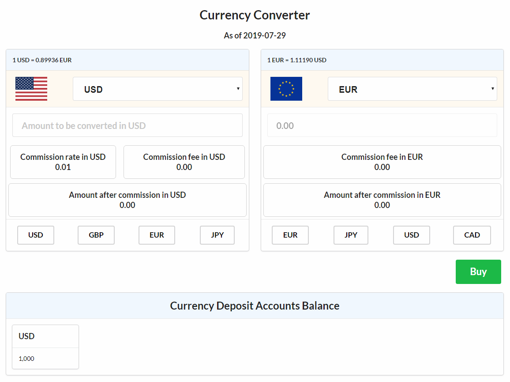

# Currency Converter with Redux

What this project is about to create an currency converter app which first lets user to convert currencies and then to see his/her user currency account balance and finally to buy selected currecies. This is Redux added version of [currency-converter-app](https://github.com/ahmetgsu/currency-converter-app).

## Table of contents:

1. Technologies used
2. Goals for this project

## Technologies used

1. React
2. React-Redux
3. Javascript (ES6 Features)
4. HTML
5. CSS (Semantic UI)

## Goals for this project:

1. To practice how to transform any React project to Redux added project
   - to use actions and Action Creators
   - to request data from api via Redux Thunk
   - to understand lifecycle methods
   - to be able to implement different event handlers
2. To practice JS ES6 features
3. To learn how to use & implement semantic ui
4. To find solutions to encountered problems
